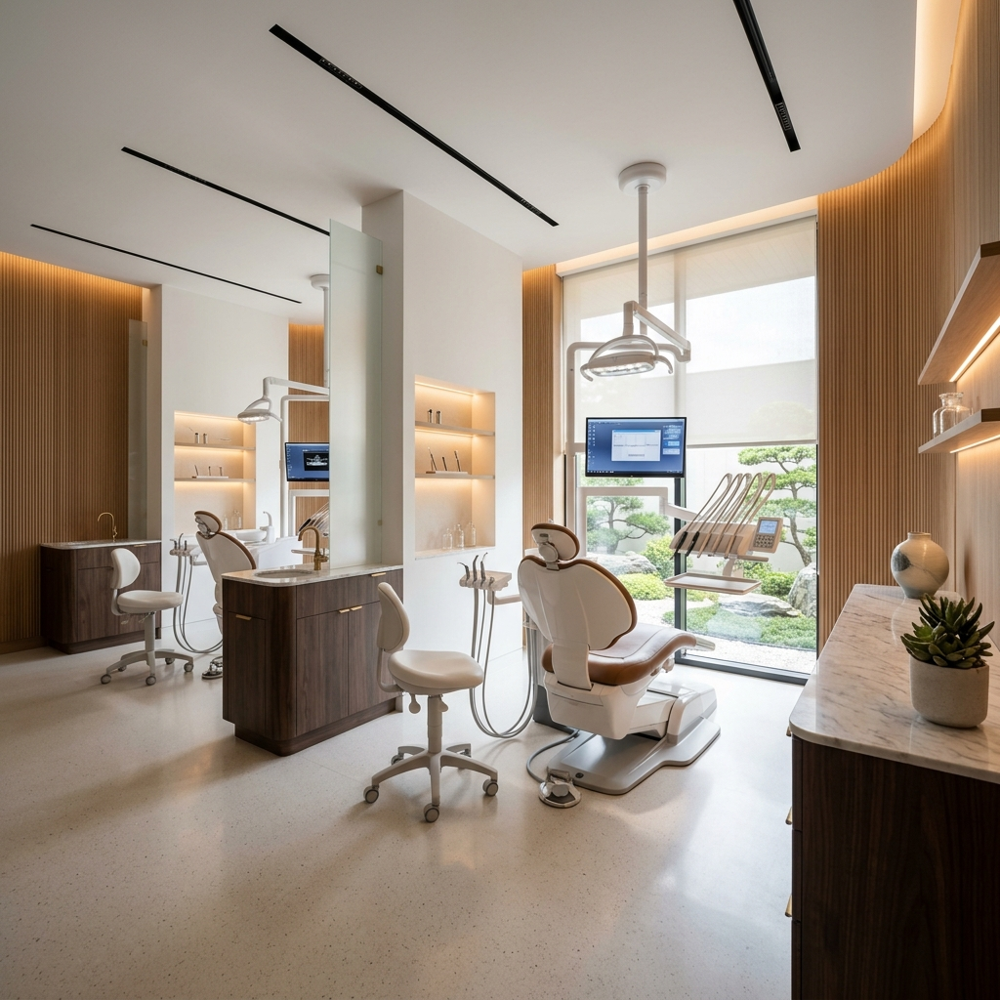

# Luxe Dental Clinic | Premium Dental Experience



## 📖 The Project Story & Philosophy

**More Than a Dental Clinic**  
Most dental clinics compete on treatments, pricing, or technology. Luxe Dental was built around a fundamentally different idea: people don't visit a dental clinic because they want a filling or an implant. They visit because they want certainty, comfort, and trust. They want to know that someone genuinely cares about the outcome.

**The Challenge**  
Many patients associate dental visits with discomfort, anxiety, confusion, and uncertainty, causing them to delay treatment for years. The dental industry has become highly focused on procedures while often overlooking the patient experience itself. Luxe Dental needed a digital platform that reflected their core belief: **great dentistry begins long before treatment starts.** It begins with trust, communication, and creating an environment where patients feel understood. However, their previous digital presence failed to convey this. It lacked the premium feel, mobile responsiveness, seamless bilingual communication, and the calming "wellness brand" aesthetic required to build patient confidence before they even step through the door.

**The Solution**  
We engineered the Luxe Dental platform from the ground up to redefine what a modern dental experience should feel like digitally. Acting on the brand archetypes of *The Caregiver* and *The Sage*, the platform was designed to feel closer to a premium wellness brand (inspired by Apple Health and Aesop) than a traditional healthcare provider. We replaced the cold, clinical feel with a sophisticated interface combining glassmorphism, warm dark modes, and buttery-smooth micro-animations. 

By implementing flawless English/Arabic (LTR/RTL) architecture, we ensured every patient receives clear, transparent, and reassuring communication in their native language. We optimized high-fidelity 4K imagery to showcase their technology and environment without compromising performance, ensuring that every digital interaction reduces stress and increases confidence.

---

## 🏛️ Brand Identity & Vision
The digital platform was strictly built to adhere to Luxe Dental's core brand pillars:
* **Prevention Before Intervention:** Heavy focus on educational content and long-term oral health over reactive treatments.
* **Transparency Builds Trust:** Clear, accessible treatment details and interactive UI elements (like the Before/After gallery) to help patients make informed decisions.
* **Technology Should Improve Human Care:** Utilizing a modern, blazing-fast web stack to ensure the booking and educational journey is as seamless and precise as their clinical laser technology.

**The Emotional Outcome:** When someone leaves this website, they should not simply remember a clinic. They should remember a feeling—the feeling that they found a place where expertise, comfort, and trust exist together.

---

## 🌟 Key Platform Features
- **Flawless Localization (i18n):** Complete English & Arabic support with automatic LTR and RTL layout switching, ensuring transparent communication for all demographics.
- **Premium Aesthetics:** High-end UI featuring glassmorphism elements, dynamic blur effects, and smooth page transitions inspired by luxury hospitality.
- **Advanced Theming:** A sophisticated Light Mode and a custom-engineered "Midnight Slate" Dark Mode with elevated shadowing to maintain a premium feel across user preferences.
- **Interactive Before/After Gallery:** A fully custom, drag-to-reveal slider allowing patients to compare dental transformations instantly.
- **Dynamic Service Filtering:** A responsive, state-driven filtering system allowing users to sort clinical services by category without page reloads.
- **SEO & Accessibility:** Fully semantic HTML, dynamic React Helmet meta tags, screen-reader ready aria-labels, and perfect mobile viewport constraints (`overflow-x-hidden`).
- **Performance Optimized:** 100% lazy-loaded imagery, optimized chunking, and fully localized asset management with zero external dependencies.

---

## 🦷 Clinical Services Provided
The platform dynamically showcases Luxe Dental's comprehensive offerings, complete with high-res clinical imagery and localized details for:

* **Cosmetic Dentistry:** Professional Teeth Whitening & Full Smile Makeovers.
* **Restorative Care:** Advanced Dental Implants & Premium Porcelain Crowns.
* **Orthodontics:** Clear Aligners (Invisalign) & Vivera Retainers.
* **Preventive Care:** Comprehensive Routine Checkups & Specialized Pediatric Dental Care.

---

## 🛠️ Tech Stack
This project was engineered for maximum performance, maintainability, and visual fidelity using modern web technologies:

* **Core:** React 19 + Vite (Blazing fast build tooling)
* **Styling & Layout:** Tailwind CSS v3 (Custom config for brand colors and RTL support)
* **Routing:** React Router v7
* **Animations:** Framer Motion (Page transitions, scroll reveals, and micro-interactions)
* **Localization:** `i18next` & `react-i18next`
* **Icons:** `lucide-react` (Clean, scalable SVG icon system)
* **SEO Management:** `react-helmet-async`

---

## 🚀 Getting Started

To run this project locally:

1. **Install Dependencies:**
   ```bash
   npm install
   ```
2. **Start the Development Server:**
   ```bash
   npm run dev
   ```
3. **Build for Production:**
   ```bash
   npm run build
   ```

---

## 👨‍💻 Credits & Intellectual Property
**Design, Code, and Idea by Abdallah Wageeh.**  
All rights reserved. This project showcases a custom-built, production-ready architecture designed specifically for the luxury medical sector, bringing the Luxe Dental philosophy to life.
